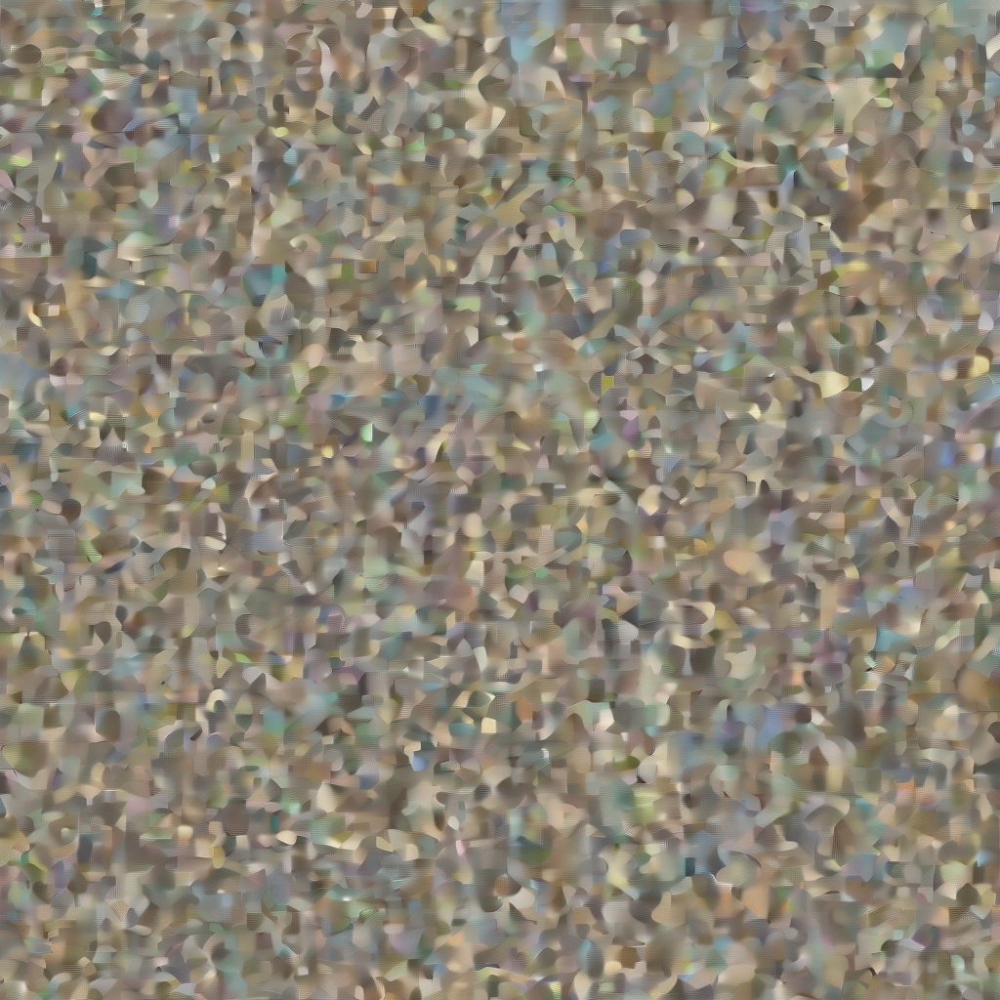
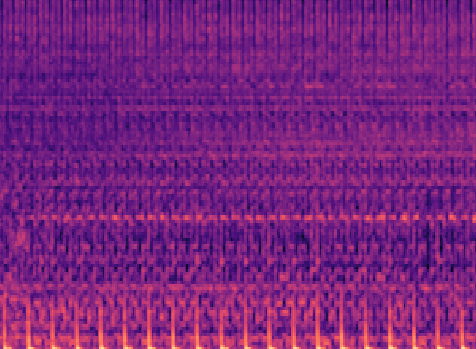
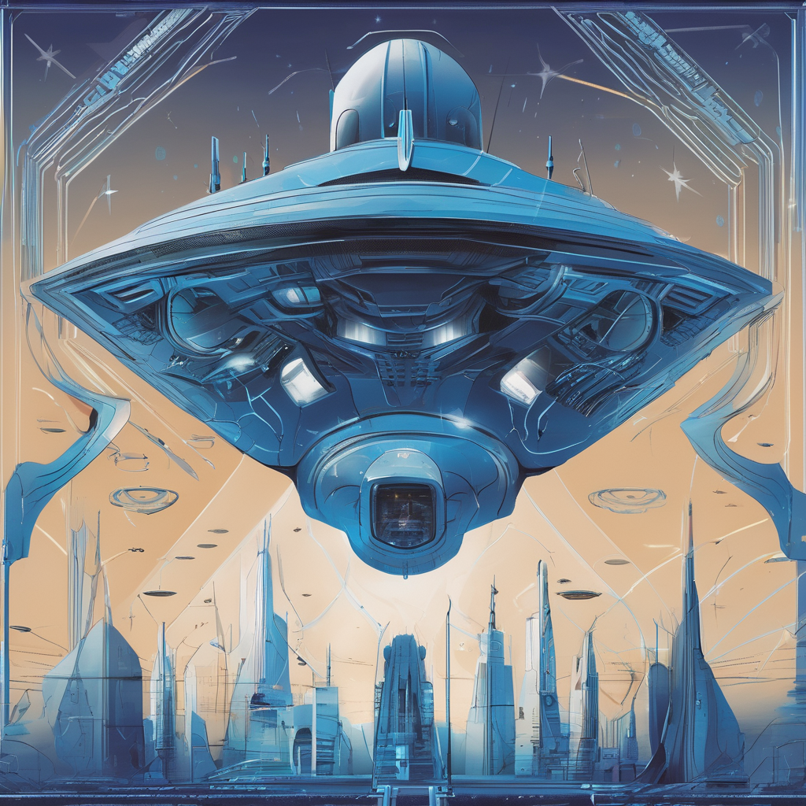

# Spectrogrand
SpectroGrand: Generating interesting audiovisuals for text prompts.

## Data Sources
- [Images that Could Be Album Covers](https://www.kaggle.com/datasets/imreallyjohn/imagesalbumcovers)
- [HouseX](https://github.com/Gariscat/HouseX)
- [MuMu](https://www.upf.edu/web/mtg/mumu)

## Outputs for Prompt topic: `Futuristic Spaceship`

### Static video

### Dynamic videos

